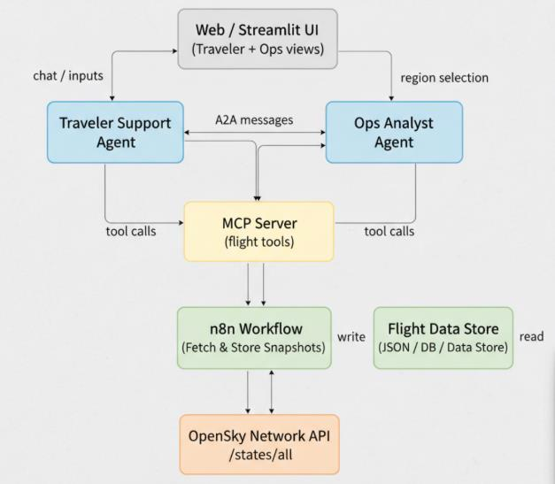
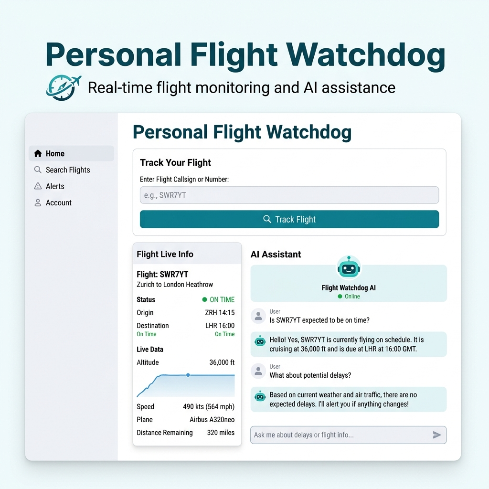
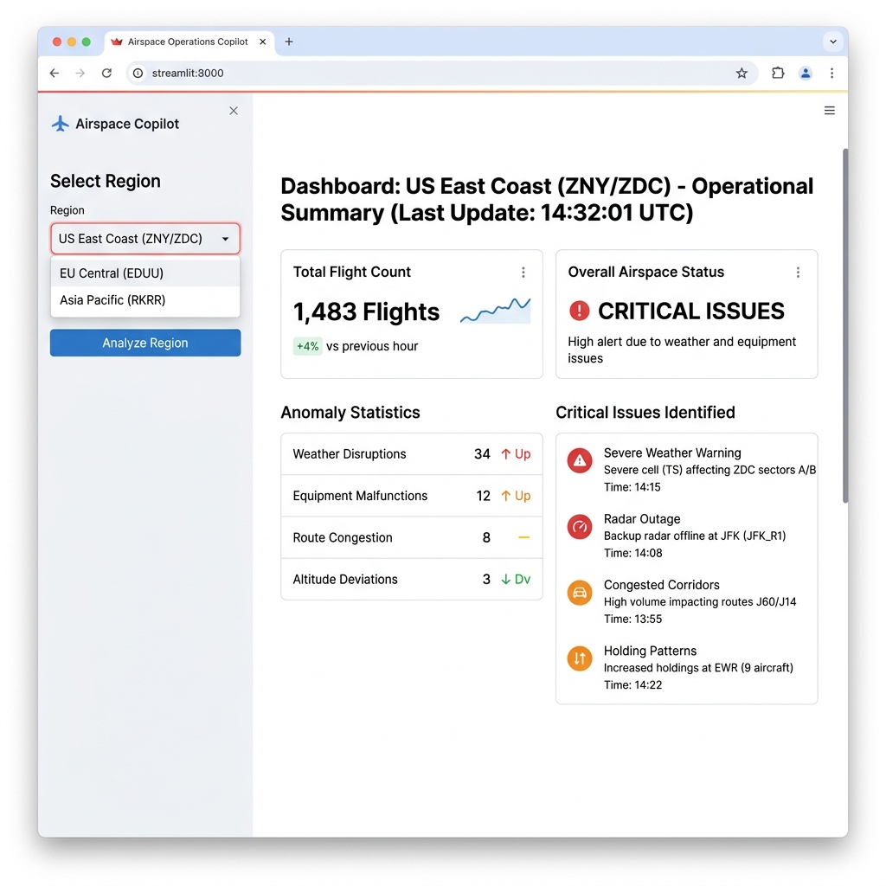

# Real-Time Airspace Copilot with Agentic Multi-Agent System

A multi-agent system that monitors live flight traffic using the OpenSky Network API and provides intelligent airspace monitoring through an Operations Copilot and Personal Flight Watchdog.

## Architecture



- **n8n**: Workflow orchestration for data fetching and storage
- **MCP Server**: Exposes flight data as tools for agents
- **CrewAI/LangGraph**: Multi-agent system with Ops Analyst and Traveler Support agents
- **Groq LLM API**: Reasoning and natural language generation
- **Frontend**: Simple UI for traveler and operations views

## Prerequisites

- Python 3.8+
- Node.js and npm (for n8n)
- Groq API key (free tier)

## Setup Instructions

### 1. Install Python Dependencies

```bash
pip install -r requirements.txt
```

### 2. Set Up n8n

n8n should already be running with your workflows:
- **Workflow 1**: Schedule Trigger → HTTP Request → Code → Write File → Code
- **Workflow 2**: Webhook → Read File → Code → Respond to Webhook

Make sure both workflows are **active** in n8n.

Test your webhook:
```
http://localhost:5678/webhook/latest-data
```

### 3. Configure Environment Variables

The `.env` file should already be created with:
```env
GROQ_API_KEY=your_groq_api_key_here
WEBHOOK_BASE_URL=http://localhost:5678/webhook
FALLBACK_DATA_DIR=C:/Users/hp/Documents
MCP_SERVER_URL=http://localhost:8000
```

### 4. Start MCP Server

In a terminal:
```bash
python start_mcp_server.py
```

Or:
```bash
python -m mcp_server.server
```

The server will start on `http://localhost:8000`

### 5. Test MCP Server

#### Health Check:
```bash
curl http://localhost:8000/health
```

#### List Available Tools:
```bash
curl http://localhost:8000/mcp/tools
```

#### Get Region Snapshot:
```bash
curl -X POST http://localhost:8000/mcp/tools/flights.list_region_snapshot \
  -H "Content-Type: application/json" \
  -d '{"region": "data"}'
```

#### Get Flight by Callsign:
```bash
curl -X POST http://localhost:8000/mcp/tools/flights.get_by_callsign \
  -H "Content-Type: application/json" \
  -d '{"callsign": "SWR7YT"}'
```

#### List Active Alerts:
```bash
curl -X POST http://localhost:8000/mcp/tools/alerts.list_active \
  -H "Content-Type: application/json" \
  -d '{}'
```

## Project Structure

```
Agentic-assign-3/
├── config/
│   └── regions.json          # Predefined region bounding boxes
├── mcp_server/
│   ├── __init__.py
│   └── server.py             # FastAPI MCP server
├── utils/
│   ├── __init__.py
│   └── anomaly_detector.py   # Anomaly detection logic
├── agents/
│   ├── __init__.py
│   ├── mcp_tools.py          # MCP tools wrapper for agents
│   ├── ops_analyst.py        # Operations Analyst Agent
│   ├── traveler_support.py   # Traveler Support Agent
│   └── crew.py               # CrewAI orchestration
├── frontend/
│   └── app.py                # Streamlit frontend
├── main.py                    # FastAPI agent server
├── start_mcp_server.py       # MCP server launcher
├── start_frontend.py          # Frontend launcher
├── test_mcp_server.py        # MCP server test script
├── requirements.txt
└── README.md
```

## MCP Tools

The MCP server exposes three tools:

1. **flights.list_region_snapshot(region)**
   - Returns the most recent snapshot for a region
   - Endpoint: `POST /mcp/tools/flights.list_region_snapshot`

2. **flights.get_by_callsign(callsign, region?)**
   - Finds the latest record for a given flight callsign
   - Endpoint: `POST /mcp/tools/flights.get_by_callsign`

3. **alerts.list_active()**
   - Returns currently flagged anomalies
   - Endpoint: `POST /mcp/tools/alerts.list_active`

## Anomaly Detection

The system detects:
- **Low speed at high altitude**: Speed < 50 m/s at altitude > 8000 m
- **Stationary at altitude**: Velocity < 5 m/s while airborne
- **Rapid descent**: Vertical rate < -20 m/s
- **Extreme altitude/speed**: Altitude > 12000 m with high speed

### 6. Start Agent API Server

In a new terminal:
```bash
python main.py
```

The API server will start on `http://localhost:8001`

### 7. Start Frontend

In a new terminal:
```bash
streamlit run frontend/app.py
```

Or:
```bash
python start_frontend.py
```

The frontend will open in your browser at `http://localhost:8501`

## Running the Complete System

You need **4 terminals/windows** running simultaneously:

1. **n8n** (already running)
   - Webhook at: `http://localhost:5678/webhook/latest-data`

2. **MCP Server**:
   ```bash
   python start_mcp_server.py
   ```
   - Running on: `http://localhost:8000`

3. **Agent API Server**:
   ```bash
   python main.py
   ```
   - Running on: `http://localhost:8001`

4. **Frontend**:
   ```bash
   streamlit run frontend/app.py
   ```
   - Running on: `http://localhost:8501`

## System Components

1. ✅ n8n workflows (completed)
2. ✅ MCP Server (completed)
3. ✅ Agentic Layer (CrewAI) (completed)
4. ✅ Frontend UI (Streamlit) (completed)
5. ✅ Integration (completed)

## API Documentation

- **MCP Server** (port 8000):
  - Swagger UI: `http://localhost:8000/docs`
  - ReDoc: `http://localhost:8000/redoc`

- **Agent API Server** (port 8001):
  - Swagger UI: `http://localhost:8001/docs`
  - ReDoc: `http://localhost:8001/redoc`

## Features

### Traveler Mode



- Enter flight callsign (e.g., SWR7YT, THY4KZ)
- Chat with AI assistant about your flight
- Get real-time flight information
- Natural language answers to questions

### Operations Mode



- Select region to analyze
- Get operational summaries
- View anomaly alerts
- Monitor airspace status

### Agent-to-Agent (A2A) Communication
- Traveler Support Agent can delegate to Ops Analyst Agent
- Automatic routing based on question type
- Seamless collaboration between agents

## Troubleshooting

### Webhook not accessible
- Ensure n8n webhook workflow is **active**
- Check webhook URL matches: `http://localhost:5678/webhook/latest-data`

### MCP Server can't find data
- Server will try webhook first, then fallback to file
- Check file path in `FALLBACK_DATA_DIR` matches your n8n write location
- Ensure file path uses forward slashes: `C:/Users/hp/Documents/`

### Port conflicts
- MCP Server uses port 8000 by default
- Change in `server.py` if needed: `uvicorn.run(app, host="0.0.0.0", port=8000)`

## License

This project is for educational purposes as part of Agentic AI Assignment 3.

